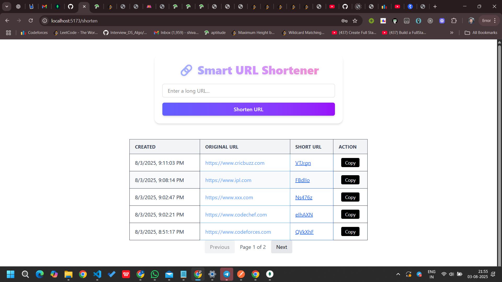
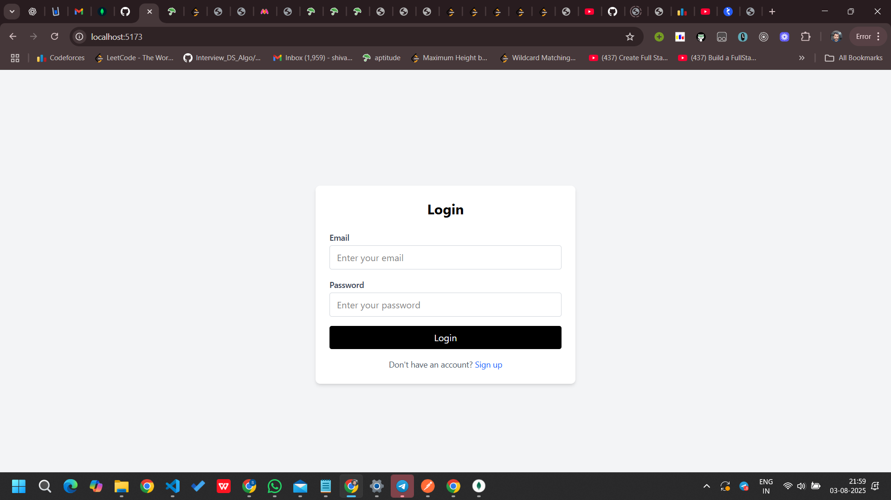

# 🔗 URL Shortener with Analytics

This is a full-stack URL shortener web application built using the MERN stack (MongoDB, Express.js, React.js, Node.js). It allows users to shorten long URLs, view the number of clicks, and manage their links with user authentication.

---

## 🚀 Features

- Shorten long URLs to compact, shareable links
- View click statistics and creation date
- User authentication with JWT
- Track per-user links
- Built-in analytics
- Responsive UI

---

## 🛠️ Tech Stack

**Frontend:** React.js, Tailwind CSS  
**Backend:** Node.js, Express.js  
**Database:** MongoDB  
**Authentication:** JWT (JSON Web Tokens)

---

## 📦 Installation

1. **Clone the repository:**

```bash
git clone https://github.com/shivcodecf/shortnerUrl.git
cd shortnerUrl
```
Backend Setup:

```bash

cd backend
npm install

```

Frontend Setup:

```bash

cd ../client
npm install

```

Create a .env file in the backend/ directory and add:

MONGO_URI= your_mongodb_url
JWT_SECRET= your_secret_key
PORT = any_port
BASE_URL= your_base_url


Run the App:

```bash


cd backend
npm run dev


cd ../client
npm run dev

```
---

📊 API Endpoints

POST /api/user/signup --  Register a new user

POST /api/user/     --    Login user

POST /shorten:      --    Accepts a long URL, returns a unique short code.

GET /:code:         --    Redirects to the original URL, and increments a click counter.
 
GET /stats/:code:   --    Returns stats like creation date and click count.

GET /getAll:         --   Returns   data  of  login  user  with  pagination 


---

🤖 AI Assistance
Some parts of this project ( and code formatting) were assisted by AI tools (ChatGPT by OpenAI) to accelerate development.
Code was understood, verified, and tested manually before being committed.
A few sections contain inline comments (e.g., // Suggested by AI and reviewed) for transparency.

Before starting the project, I focused on understanding the core logic behind how a URL shortening service works — specifically, what happens behind the scenes when a user enters an original URL. This helped guide the flow of both backend API design and frontend integration.


---

⚠️ Important Note

 Please ensure that original URLs begin with `http://` or `https://`  

 ❌ `www.example.com` → will not work  

✅ `https://www.example.com` → valid


---


📸 Screenshots




💡 Made with ❤️ by Shivam Yadav


